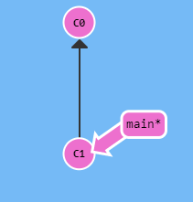
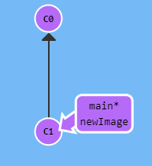
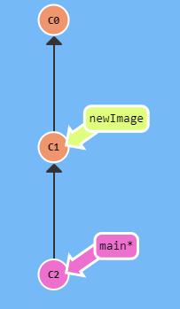

# git

### 깃은 컴퓨터 파일의 변경사항을 추적하고 여러 명의 사용자들 간에 해당 파일들의 작업을 조율하기 위한 분산 버전 관리 시스템입니다

# Git 브랜치 배우기

##### https://learngitbranching.js.org/?locale=ko 이 사이트를 참고하여 작성하였습니다

## 1. git commit (깃 커밋)

- 프로젝트의 스냅샷 (기록을 저장)
- 매우 가볍고 커밋 사이의 전환이 빠름

### 사용방법

```
git commit -m "메세지"
git commit -am "메세지"
```

`git commit -m "메세지"` : -m 옵션부터 알아보자면 massage를 의미한다 따라서 "메세지"와 함께 기록(커밋)한다는 의미
`git commit -am` : Staging Area에 올림과 동시에 커밋 ( git add . + git commit -m "커밋메세지")

###### Staging Area (스테이지 영역) : 곧 커밋할 파일에 대한 정보를 저장하는 파일

### Ex)


<br/>

#### 이런 git 저장소가 있을때

#### `git commit`을 하면


<br/>

#### 이렇게 c2 가 새로운 커밋으로 저장되는 것이다

## 2. git branch (깃 브랜치)

- 하나의 커밋과 그 부모 커밋들을 포함하는 작업 내역

#### 사용방법

```
git branch
git branch -r
git branch -v
git branch 브랜치 명
git checkout 브랜치 명
git checkout -b 브랜치명
git branch -d 브랜치명
git push -u origin 브랜치명
```

#### `git branch` : 내가 위치한 branch 확인

#### `git branch -r`: 원격 저장소의 브랜치 확인

#### `git branch -v`: 브랜치의 마지막 커밋 메세지 확인

#### `git branch 브랜치 이름` : 브랜치 생성

#### `git checkout 브랜치 명` : branch 이동하기

#### `git checkout -b 브랜치명` : 브랜치 생성후 바로 이동하기

#### `git branch -d 브랜치명` : 브랜치 삭제

#### `git push -u origin 브랜치명` : 생성한 브랜치를 원격 레파지토리에 push (git push --set-upstream origin test를 줄인것)

### Ex)


<br/>

#### 이런 git 저장소가 있을때

#### `git branch newImage`을 하면


<br/>

#### 이렇게 `newImage` 가 커밋 C1을 가르키게 된다

#### 이상태에서 `git commit`을 하게되면


<br/>

#### 이렇게 newImage는 여전히 c1을 가르키고 새로 커밋한 c2는 main 브랜치가 가르키게 된다

#### 왜냐하면 현재 작업중인 브랜치가 main이기 때문이다

#### 만약


<br/>

#### 이상태에서 main이 아닌 새 브런치로 이동하여 커밋 하고 싶다면

#### `git checkout newImage; git commit` 이렇게 하여 현재 작업중인 브랜치를 newImage로 변경해준후 커밋하면 된다
