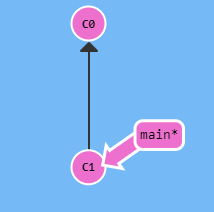
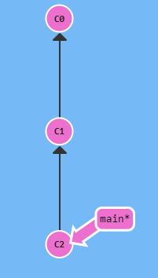

# git

### 깃은 컴퓨터 파일의 변경사항을 추적하고 여러 명의 사용자들 간에 해당 파일들의 작업을 조율하기 위한 분산 버전 관리 시스템입니다

# Git 브랜치 배우기

##### https://learngitbranching.js.org/?locale=ko 이 사이트를 참고하여 작성하였습니다

## 1. git commit (깃 커밋)

- 프로젝트의 스냅샷 (기록을 저장)
- 매우 가볍고 커밋 사이의 전환이 빠름

### 사용방법

```
git commit -m "메세지"
git commit -am "메세지"
```

`git commit -m "메세지"` : -m 옵션부터 알아보자면 massage를 의미한다 따라서 "메세지"와 함께 기록(커밋)한다는 의미
`git commit -am` : Staging Area에 올림과 동시에 커밋 ( git add . + git commit -m "커밋메세지")

###### Staging Area (스테이지 영역) : 곧 커밋할 파일에 대한 정보를 저장하는 파일

### Ex)


<br/>

#### 이런 git 저장소가 있을때

#### `git commit`을 하면


<br/>

#### 이렇게 c2 가 새로운 커밋으로 저장되는 것이다

## 2. git branch (깃 브랜치)
